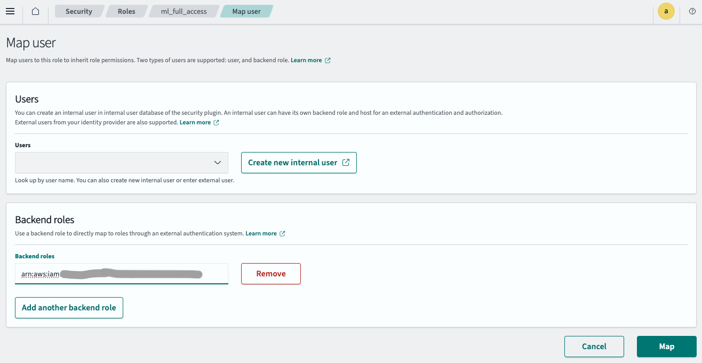

# Topic

> The easiest way for setting up embedding model on your Amazon OpenSearch cluster is using [AWS CloudFormation](https://docs.aws.amazon.com/opensearch-service/latest/developerguide/cfn-template.html)

> This tutorial explains detail steps if you want to configure everything manually. 

> Bedrock has [quota limit](https://docs.aws.amazon.com/bedrock/latest/userguide/quotas.html). You can purchase [Provisioned Throughput](https://docs.aws.amazon.com/bedrock/latest/userguide/prov-throughput.html) to increase quota limit.

This doc introduces how to build semantic search in Amazon managed OpenSearch with [Bedrock Titan embedding model](https://docs.aws.amazon.com/bedrock/latest/userguide/titan-embedding-models.html).
If you are not using Amazon OpenSearch, you can refer to [bedrock_connector_titan_embedding_blueprint](https://github.com/opensearch-project/ml-commons/blob/2.x/docs/remote_inference_blueprints/bedrock_connector_titan_embedding_blueprint.md).

Note: You should replace the placeholders with prefix `your_` with your own value

# Steps

## 0. Create OpenSearch cluster

Go to AWS OpenSearch console UI and create OpenSearch domain.

Copy the domain ARN which will be used in later steps.

## 1. Create IAM role to invoke Bedrock model
To invoke Bedrock model, we need to create an IAM role with proper permission.
This IAM role will be configured in connector. Connector will use this role to invoke Bedrock model.

Go to IAM console, create IAM role `my_invoke_bedrock_cohere_role` with:

- Custom trust policy:
```
{
    "Version": "2012-10-17",
    "Statement": [
        {
            "Effect": "Allow",
            "Principal": {
                "Service": "es.amazonaws.com"
            },
            "Action": "sts:AssumeRole"
        }
    ]
}
```
- Permission
```
{
    "Version": "2012-10-17",
    "Statement": [
        {
            "Action": [
                "bedrock:InvokeModel"
            ],
            "Effect": "Allow",
            "Resource": "arn:aws:bedrock:*::foundation-model/cohere.embed-english-v3"
        }
    ]
}
```

If you need to support multi-language, you can use multilingual model: `cohere.embed-multilingual-v3`

Copy the role ARN which will be used in later steps.

## 2. Configure IAM role in OpenSearch

### 2.1 Create IAM role for Signing create connector request

Generate a new IAM role specifically for signing your create connector request.


Create IAM role `my_create_bedrock_cohere_connector_role` with 
- Custom trust policy. Note: `your_iam_user_arn` is the IAM user which will run `aws sts assume-role` in step 3.1
```
{
    "Version": "2012-10-17",
    "Statement": [
        {
            "Effect": "Allow",
            "Principal": {
                "AWS": "your_iam_user_arn"
            },
            "Action": "sts:AssumeRole"
        }
    ]
}
```
- permission
```
{
    "Version": "2012-10-17",
    "Statement": [
        {
            "Effect": "Allow",
            "Action": "iam:PassRole",
            "Resource": "your_iam_role_arn_created_in_step1"
        },
        {
            "Effect": "Allow",
            "Action": "es:ESHttpPost",
            "Resource": "your_opensearch_domain_arn_created_in_step0"
        }
    ]
}
```

Copy this role ARN which will be used in later steps.

### 2.2 Map backend role

1. Log in to your OpenSearch Dashboard and navigate to the "Security" page, which you can find in the left-hand menu.
2. Then click "Roles" on security page (you can find it on left-hand), then find "ml_full_access" role and click it. 
3. On "ml_full_access" role detail page, click "Mapped users", then click "Manage mapping". Paste IAM role ARN created in step 2.1 to backend roles part.
Click "Map", then the IAM role configured successfully in your OpenSearch cluster.



## 3. Create Connector

Find more details on [connector](https://opensearch.org/docs/latest/ml-commons-plugin/remote-models/connectors/)


### 3.1 Get temporary credential of the role created in step 2.1:
```
aws sts assume-role --role-arn your_iam_role_arn_created_in_step2.1 --role-session-name your_session_name
```

Configure the temporary credential in `~/.aws/credentials` like this

```
[default]
AWS_ACCESS_KEY_ID=your_access_key_of_role_created_in_step2.1
AWS_SECRET_ACCESS_KEY=your_secret_key_of_role_created_in_step2.1
AWS_SESSION_TOKEN=your_session_token_of_role_created_in_step2.1
```

### 3.2 Create connector

Run this python code with the temporary credential configured in `~/.aws/credentials`

Read [Cohere blueprint](https://github.com/opensearch-project/ml-commons/blob/main/docs/remote_inference_blueprints/cohere_connector_embedding_blueprint.md) for more details.

```
import boto3
import requests 
from requests_aws4auth import AWS4Auth

host = 'your_amazon_opensearch_domain_endpoint_created_in_step0'
region = 'your_amazon_opensearch_domain_region'
service = 'es'

credentials = boto3.Session().get_credentials()
awsauth = AWS4Auth(credentials.access_key, credentials.secret_key, region, service, session_token=credentials.token)

path = '/_plugins/_ml/connectors/_create'
url = host + path

payload = {
  "name": "Amazon Bedrock Cohere Connector: embedding v3",
  "description": "The connector to Bedrock Cohere embedding model",
  "version": 1,
  "protocol": "aws_sigv4",
  "parameters": {
    "region": "your_bedrock_model_region",
    "service_name": "bedrock",
    "input_type":"search_document",
    "truncate": "END"
  },
  "credential": {
    "roleArn": "your_iam_role_arn_created_in_step1"
  },
  "actions": [
    {
      "action_type": "predict",
      "method": "POST",
      "url": "https://bedrock-runtime.your_bedrock_model_region.amazonaws.com/model/cohere.embed-english-v3/invoke",
      "headers": {
        "content-type": "application/json",
        "x-amz-content-sha256": "required"
      },
      "request_body": "{ \"texts\": ${parameters.texts}, \"truncate\": \"${parameters.truncate}\", \"input_type\": \"${parameters.input_type}\" }",
      "pre_process_function": "connector.pre_process.cohere.embedding",
      "post_process_function": "connector.post_process.cohere.embedding"
    }
  ]
}

headers = {"Content-Type": "application/json"}

r = requests.post(url, auth=awsauth, json=payload, headers=headers)
print(r.text)
```
The script will output connector id.

sample output
```
{"connector_id":"1p0u8o0BWbTmLN9F2Y7m"}
```

Copy connector id which will be used in later steps.

## 4. Create Model and test

Login your OpenSearch Dashboard, open DevTools, then run these

1. Create model group
```
POST /_plugins/_ml/model_groups/_register
{
    "name": "Bedrock_embedding_model",
    "description": "Test model group for bedrock embedding model"
}
```
Sample output
```
{
  "model_group_id": "050q8o0BWbTmLN9Foo4f",
  "status": "CREATED"
}
```

2. Register model

```
POST /_plugins/_ml/models/_register
{
  "name": "Bedrock Cohere embedding model v3",
  "function_name": "remote",
  "description": "test embedding model",
  "model_group_id": "050q8o0BWbTmLN9Foo4f",
  "connector_id": "0p0p8o0BWbTmLN9F-o4G"
}
```
Sample output
```
{
  "task_id": "TRUr8o0BTaDH9c7tSRfx",
  "status": "CREATED",
  "model_id": "VRUu8o0BTaDH9c7t9xet"
}
```

3. Deploy model
```
POST /_plugins/_ml/models/VRUu8o0BTaDH9c7t9xet/_deploy
```
Sample output
```
{
  "task_id": "1J0r8o0BWbTmLN9FjY6I",
  "task_type": "DEPLOY_MODEL",
  "status": "COMPLETED"
}
```
4. Predict
```
POST /_plugins/_ml/models/VRUu8o0BTaDH9c7t9xet/_predict
{
  "parameters": {
    "texts": ["hello world"]
  }
}
```
Sample response
```
{
  "inference_results": [
    {
      "output": [
        {
          "name": "sentence_embedding",
          "data_type": "FLOAT32",
          "shape": [
            1024
          ],
          "data": [
            -0.02973938,
            -0.023651123,
            -0.06021118,
            ...]
        }
      ],
      "status_code": 200
    }
  ]
}
```

## 5. Semantic search

### 5.1 create ingest pipeline
Find more details: [ingest pipeline](https://opensearch.org/docs/latest/ingest-pipelines/)

```
PUT /_ingest/pipeline/my_bedrock_cohere_embedding_pipeline
{
    "description": "text embedding pentest",
    "processors": [
        {
            "text_embedding": {
                "model_id": "your_bedrock_embedding_model_id_created_in_step4",
                "field_map": {
                    "text": "text_knn"
                }
            }
        }
    ]
}
```
### 5.2 create k-NN index
Find more details: [k-NN index](https://opensearch.org/docs/latest/search-plugins/knn/knn-index/)

You should customize your k-NN index for better performance.
```
PUT my_index
{
  "settings": {
    "index": {
      "knn.space_type": "cosinesimil",
      "default_pipeline": "my_bedrock_cohere_embedding_pipeline",
      "knn": "true"
    }
  },
  "mappings": {
    "properties": {
      "text_knn": {
        "type": "knn_vector",
        "dimension": 1024
      }
    }
  }
}
```
### 5.3 ingest test data
```
POST /my_index/_doc/1000001
{
    "text": "hello world."
}
```
### 5.4 search
Find more details: [neural search](https://opensearch.org/docs/latest/search-plugins/neural-search/).
```
POST /my_index/_search
{
  "query": {
    "neural": {
      "text_knn": {
        "query_text": "hello",
        "model_id": "your_embedding_model_id_created_in_step4",
        "k": 100
      }
    }
  },
  "size": "1",
  "_source": ["text"]
}
```